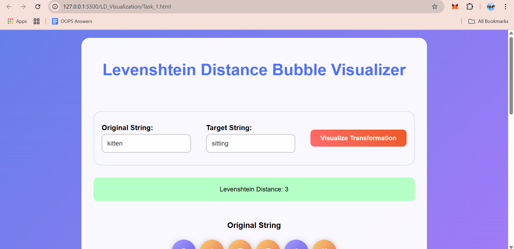
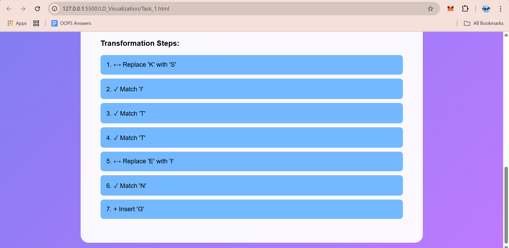
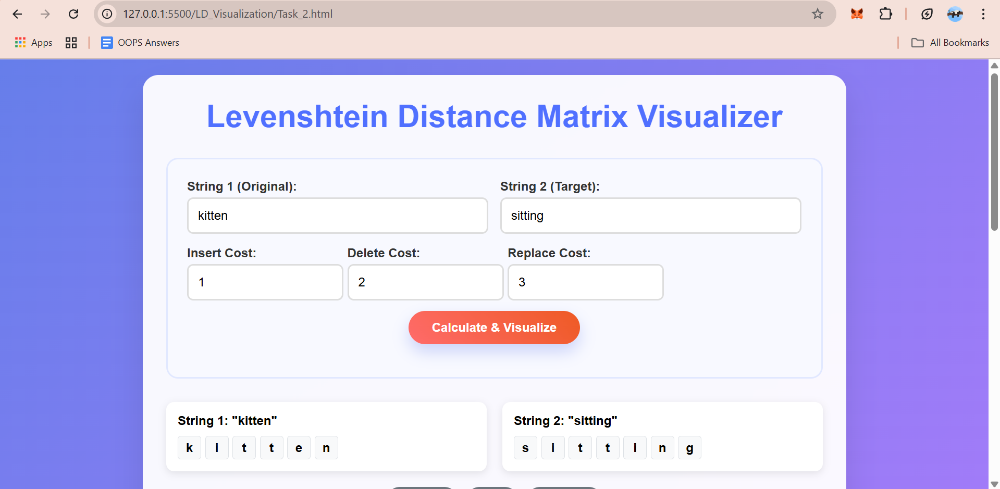
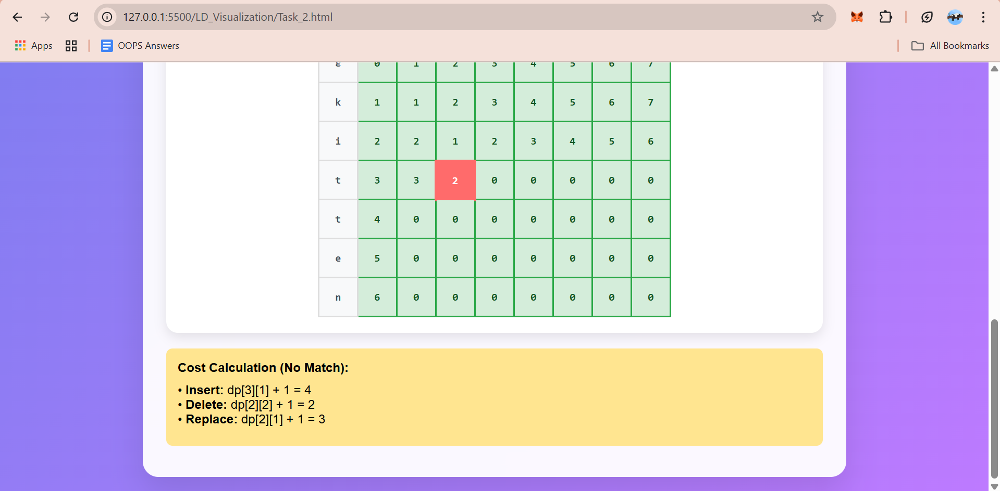
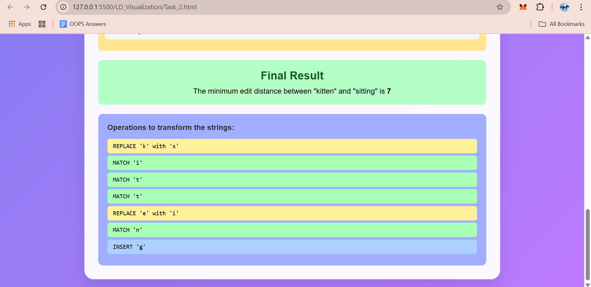
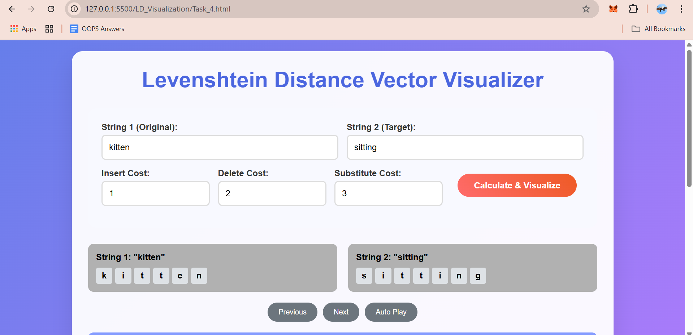
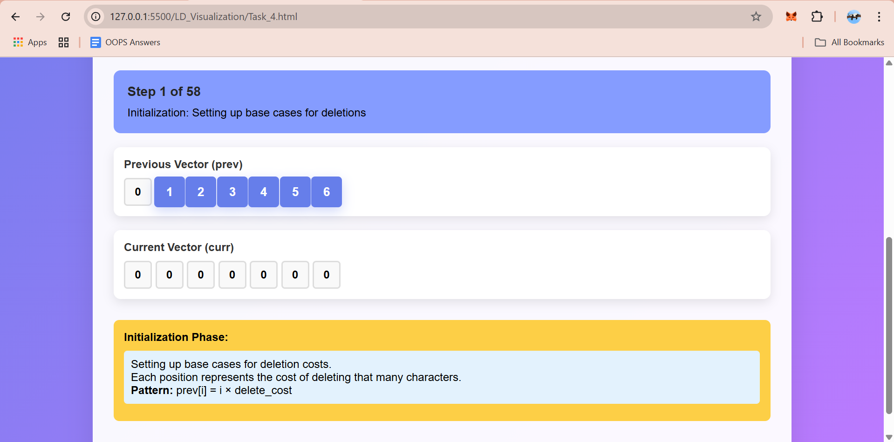

# Hi, this is a project to show case Levenshtein Algorithm.
1. C++ code to represent it in terminal.
2. HTML, CSS and Javascript for visualization the algorithm stepwise.

# Note 
- Just click on **index.html** to open the visualization of all 4 task in your browser.

# Project Structure:
 -> LD_CPP - CPP code for all 4 tasks.
 -> LD_Visualization - HTML, CSS and Javascript code for visualization of the algorithm.  
 -> Screenshots_CPP - Screenshots of the terminal output for the CPP code.
 -> Screenshots_Visualization - Screenshots of the browser output for the visualization code.
- Any Gen AI tools (like ChatGPT, Gemini, Meta etc.), third-party libraries, frameworks, or any open-source code is **not** being used in this project.
- **Everything** is written from scratch by me, using vallina C++, CSS and JavaScript.

# Results: 

 

### Task 1: Implement the Levenshtein Algorithm
- Recursive Implementation
- Time Complexity: O(3^N)
- Space Complexity: O(N) {Stack Space}
- one function returns only minimum edit distance.
- other function returns the minimum edit distance and the operations performed to convert one string to another.
 
 
 

### Task 2: Minimum Weighted Edit Distance Calculation
- DP Matrix Implementation
- Time Complexity: O(M*N)
- Space Complexity: O(M*N) {DP Matrix}
- one function returns only minimum edit distance.
- other function returns the minimum edit distance and the operations performed to convert one string to another.
 
 
 
 

### Task 3: Apply It to a Real Problem
- In this task, I addressed common issues related to phishing attacks and reusing similar passwords across different accounts.
1. Stored trusted URLs/emails and previous passwords in two separate vectors.
2. Took user input for a URL/email or a new password.
3. Calculated the minimum edit distance between the input and stored values.
4. Computed similarity percentage based on edit distance.
5. For phishing detection, used three categories:
    a. Identified (exact match with stored trusted domain)
    b.Phishing (similarity above 65%)
    c. Not Identified (not matching any trusted domain)
6. For passwords, used two categories:
    a. Recommended to change password (similarity above 70%)
    b. Recommended (sufficiently different from stored passwords)
 
 
 
 
 
 

### Task 4: Optimization Task (Bonus) --> Space Complexity reduced
- DP Vector Implementation
- Time Complexity: O(M*N) - 2 loops required to traverse each character of both strings. {comparing}
- Space Complexity: O(2N) {2 DP Vectors} - previous and current row.
- As in the task_2 (DP Matrix), only last 2 rows were needed, previous one and current one to perform the calculations
- function returns only minimum edit distance and prints the whole calculation for both the vectors.
- Time Complexity can't be reduced further, as we need to traverse both the strings and compare characters of one with other. { 2 loops are needed, for such traversal. }
 
 
 

